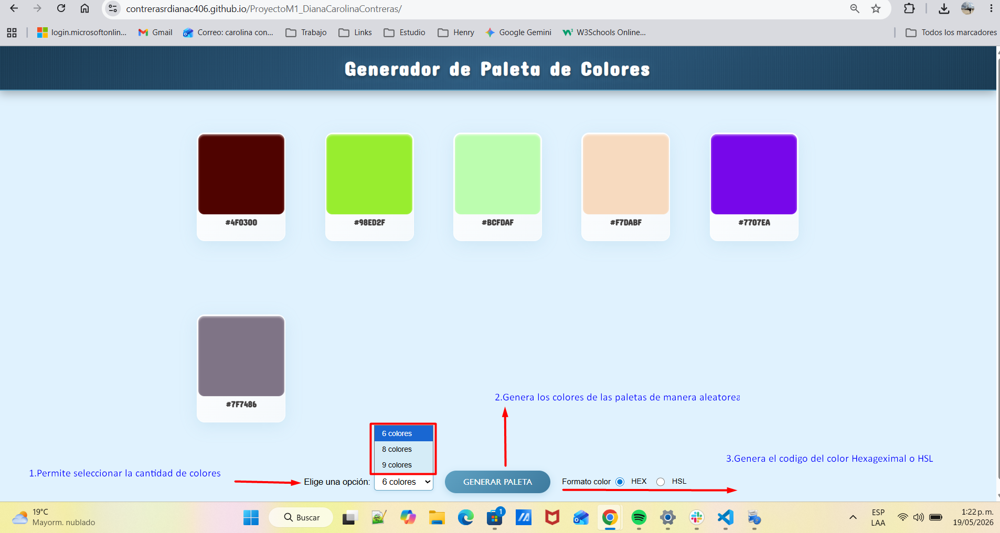

# 🎨 Generador de Paleta de Colores

Una aplicación web interactiva que genera paletas de colores aleatorias, permitiendo personalizar la cantidad de colores y elegir entre diferentes formatos de representación.

## 📋 Descripción

Este proyecto es un generador de paletas de colores que te permite:

- Generar paletas de colores aleatorias de forma dinámica
- Seleccionar la cantidad de colores (6, 8 o 9 colores)
- Visualizar los colores en dos formatos diferentes: Hexadecimal y HSL
- Cambiar entre formatos sin necesidad de regenerar la paleta
- Interfaz intuitiva y responsive

## ✨ Características

- **Generación de colores aleatoria**: Crea combinaciones de colores únicas cada vez
- **Múltiples formatos**:
  - Hexadecimal (#RRGGBB)
  - HSL (Hue, Saturation, Lightness)
- **Paletas personalizables**: Elige entre 6, 8 o 9 colores por paleta
- **Interfaz moderna**: Diseño limpio con tarjetas de color bien organizadas
- **Selector de cantidad de colores**: Dropdown para elegir cuántos colores deseas
- **Radio buttons para formato**: Cambia entre HEX y HSL sin regenerar

## 🏗️ Estructura del Proyecto

```
ProyectoFinal/
├── index.html          # Estructura HTML de la aplicación
├── CSS/
│   └── style.css       # Estilos y diseño responsivo
├── JS/
│   └── script.js       # Lógica de generación de colores
└── README.md           # Este archivo
```

## 🚀 Cómo Usar

1. **Abrir la aplicación**: Abre `index.html` en tu navegador web
2. **Seleccionar cantidad de colores**: Usa el dropdown "Elige una opción" para elegir 6, 8 o 9 colores
3. **Generar paleta**: Haz clic en el botón "Generar paleta" para crear una nueva paleta
4. **Elegir formato**: Selecciona entre Hexadecimal o HSL usando los radio buttons
5. **Ver colores**: Los colores se mostrarán en las tarjetas con su código en el formato seleccionado



## Demo

1. **Demo de la apliocación**: En el siguiente link se puede visualizar el funcionamiento de la aplicación.
   https://canva.link/5r3l8jdoy44hy5l

## 🔧 Tecnologías Utilizadas

- **HTML5**: Estructura semántica de la aplicación
- **CSS3**: Estilos y diseño responsivo con flexbox y grid
- **JavaScript (Vanilla)**: Generación de colores y manipulación del DOM
- **Conversión de colores**: Algoritmo de conversión HEX a HSL

## 📝 Funcionalidades Técnicas

### Generación de colores

- Genera códigos hexadecimales aleatorios válidos
- Almacena los valores originales en formato HEX

### Conversión HEX a HSL

- Algoritmo de conversión que transforma hexadecimal a HSL
- Mantiene precisión en los cálculos de tono, saturación y luminosidad

### Interactividad

- Event listeners para cambios en el dropdown de cantidad
- Event listeners para cambios en los radio buttons de formato
- Botón para regenerar la paleta manualmente

## 🎯 Requisitos

- Navegador web moderno (Chrome, Firefox, Safari, Edge)
- No requiere instalación de dependencias
- No requiere conexión a internet

## � Pasos para Descargar y Ejecutar en Local

### Opción 1: Descargar el repositorio (si está en GitHub)

1. **Descargar el proyecto**:
   - Haz clic en el botón `Code` (verde) en el repositorio
   - Selecciona `Download ZIP`
   - Descomprime el archivo en la carpeta donde desees guardar el proyecto

2. **Alternativa con Git**:
   ```bash
   git clone https://github.com/contrerasrdianac406/ProyectoM1_DianaCarolinaContreras.git
   ```

### Opción 2: Descargar archivos directamente

1. **Descarga manual**:
   - Descarga cada archivo (`index.html`, `style.css`, `script.js`) desde el repositorio
   - Crea la estructura de carpetas:
     ```
     ProyectoFinal/
     ├── index.html
     ├── CSS/
     │   └── style.css
     └── JS/
         └── script.js
     ```

### Pasos para Ejecutar

1. **Opción 1 - Abrir directamente en el navegador** (más simple):
   - Navega hasta la carpeta del proyecto
   - Haz doble clic en `index.html`
   - La aplicación se abrirá automáticamente en tu navegador predeterminado

2. **Opción 2 - Usar un servidor local** (recomendado):

   **Con Live Server (VS Code)**:
   - Abre la carpeta del proyecto en VS Code
   - Instala la extensión "Live Server" de Ritwick Dey
   - Haz clic derecho en `index.html` y selecciona "Open with Live Server"

### Verificación de Instalación

Cuando la aplicación esté abierta:

- Deberías ver un título "Generador de Paleta de Colores"
- Un dropdown para seleccionar cantidad de colores
- Radio buttons para elegir formato (HEX o HSL)
- Un botón "Generar paleta"
- Las tarjetas de colores deberían aparecer al generar

## 🚀 Desplegar en GitHub Pages

#### Paso 1: Activar GitHub Pages

1. **Accede a la configuración del repositorio**:
   - Ve a tu repositorio en GitHub
   - Haz clic en `Settings` (Configuración)
   - En el menú lateral, selecciona `Pages`

2. **Configura la rama de publicación**:
   - En la sección "Build and deployment"
   - En "Source", selecciona `Deploy from a branch`
   - En "Branch", elige `main` (o la rama que uses)
   - En "Folder", selecciona `/ (root)`
   - Haz clic en `Save`

3. **Espera a que se publique**:
   - GitHub Pages compilará y publicará tu sitio
   - Deberías ver un mensaje verde: "Your site is live at https://contrerasrdianac406.github.io/ProyectoM1_DianaCarolinaContreras/https://tu-usuario.github.io/nombre-del-repositorio"

#### Paso 3: Acceder a tu aplicación

Tu aplicación estará disponible en:

```
https://contrerasrdianac406.github.io/ProyectoM1_DianaCarolinaContreras/
```

## 📄 Licencia

Proyecto personal - Libre para uso educativo.
